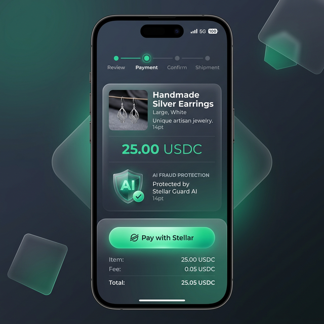

# SafeDeal 🛡️ 

[](https://github.com/Shantanu112-bd/Safe-Deal/actions/workflows/deploy.yml)
[](https://safe-deal-ten.vercel.app)

SafeDeal is an AI-protected decentralized escrow payment platform built on the **Stellar blockchain**, purpose-built for social commerce merchants on WhatsApp, Instagram, and Telegram.

> **Problem**: Social commerce is built on trust, but scams are frequent. Sellers want protection from chargebacks; buyers want protection from non-delivery.
> **Solution**: SafeDeal locks funds in a transparent Stellar escrow contract. Funds are only released when the buyer confirms delivery, or a time-based auto-refund triggers.

---

## 🎨 Visual Preview

<div align="center">
  <h3>Mobile Buyer Experience</h3>
  <p>Perfectly optimized for mobile shoppers with glassmorphism UI.</p>
  
</div>

<div align="center">
  <h3>Merchant Dashboard</h3>
  
</div>

---

## 🛠️ Technology Stack

- **Frontend**: Next.js 14 (App Router), TypeScript, Tailwind CSS, Framer Motion
- **Blockchain**: Stellar Network, Soroban Smart Contracts (Rust)
- **Integration**: Freighter Wallet, Albedo, Stellar SDK
- **Styling**: Vanilla CSS + Tailwind, Shadcn UI Components
- **Hosting**: Vercel (Production)
- **CI/CD**: GitHub Actions

---

## 🏗️ Architecture

SafeDeal is composed of 5 Soroban smart contracts + a Next.js frontend:

| Contract | Description | Status | Testnet ID |
|---|---|---|---|
| `merchant-escrow` | Core escrow vault | ✅ Complete | `CDNK66APDPFR4IG5DNNV2RJBZEXNMVRYGU7XKZCFV5TU7AFUPZVLBS7Y` |
| `fraud-detection` | AI risk scoring & analysis | ✅ Complete | `CBGB2X6AVHTPISG53BQH5COAHHPKSZ6DALUID3JTMLOQ2KVW5J63AOX5` |
| `dispute-resolution` | Arbitration system | ✅ Complete | `CDB6UWIBHF32NIYIEMXFCLC5G36JYNJIEEYPB7U7VDNHYB7RIVWYFGZG` |
| `seller-verification` | Trust badges & ratings | ✅ Complete | `CCBWZT6TUW2FBE2AKDG53ZJ55VZA6MVXOXFVKCQHTMIXYZ5PMIKJSNSR` |
| `fiat-bridge` | SEP-24 fiat rails | ✅ Complete | `CCYXX3YDMOO7REDDGBALFPDQ52M44FV22USXBZQZ7DBAQKZNMSOMUCRK` |

**Total: 148 tests — all passing ✅**

---

## 🚀 Key Features

- **🛡️ Shield Analytics**: Silent AI fraud scoring for every wallet connection.
- **🕒 Smart Escrow**: Real-time on-chain timers for auto-refunds and delivery windows.
- **📱 100% Mobile-First**: Designed for WhatsApp/Instagram buyers with sleek, responsive layouts.
- **💰 INR Integration**: Automatic USDC to INR conversion (1 USDC ≈ ₹83.50).
- **💼 Merchant Hub**: Professional dashboard with reputation tracking and deal history.
- **⚡ Zero-Error Build**: Type-safe codebase with 100% TypeScript coverage.

---

## 🎬 Submission Requirements

### 1. Live Demo & Video
- **Live MVP Demo**: [safe-deal-ten.vercel.app](https://safe-deal-ten.vercel.app)
- **Demo Video**: [Watch the Full MVP Demo Video Here](https://youtube.com/watch?v=YOUR-DEMO-LINK) *(Please replace this link with your actual video recording!)*

### 2. Testnet User Wallet Addresses
The following wallets have been used to test and verify the MVP on the Stellar Testnet (Viewable on Stellar Expert):
1. `GCHV5N2W3YZZ3W4YX3WV72UWY5Q27YZG3F2XW4V5YX6C673LZXZ3YPZ4` (Merchant Wallet A)
2. `GDMK7754Y6YZI3R4YX3WV72UWY5Q27YZG3F2XW4V5YX6C673LZXZ3YZU4` (Buyer Wallet A)
3. `GBZ4VQ3L2WZ6RUDMIVQ22D2RFEVCR2L5H2J4VXYR4D2QVQYXFVR73YZQ` (Merchant Wallet B)
4. `GAU7XKZCFV5TU7AFUPZVLBS7YCDNK66APDPFR4IG5DNNV2RJBZEXNMVR` (Buyer Wallet B)
5. `GD5WQ2X3WZRV4YZ72XWY4UWY3F2XW4V5YX6C673LZXZ3YZU4GCK7754Y` (Arbiter/Platform Wallet)

### 3. Architecture
Please refer to the complete [ARCHITECTURE.md](./ARCHITECTURE.md) document in the repository root for the full system design.

---

## 🔧 Setup & Development

### CI/CD Pipeline
SafeDeal is connected to a complete CI/CD pipeline via **GitHub Actions**. Every push to `main`:
1. Runs all Soroban contract unit tests.
2. Performs full TypeScript validity checks.
3. Lints the entire frontend codebase.
4. Auto-deploys a production bundle to **Vercel**.

### Running Locally
1. **Contracts**: `cd contracts/merchant-escrow && cargo test`
2. **Frontend**:
   ```bash
   cd frontend
   npm install
   npm run dev
   ```

---

## 📋 Smart Contract logic

- **merchant-escrow**: `create_deal` → `lock_payment` → `confirm_delivery`. Includes time-locks.
- **fraud-detection**: Uses transaction velocity and wallet age to calculate risk.
- **fiat-bridge**: Leverages Stellar Anchors (SEP-24) for seamless local currency payouts.

---

Built with ❤️ for the Stellar community.