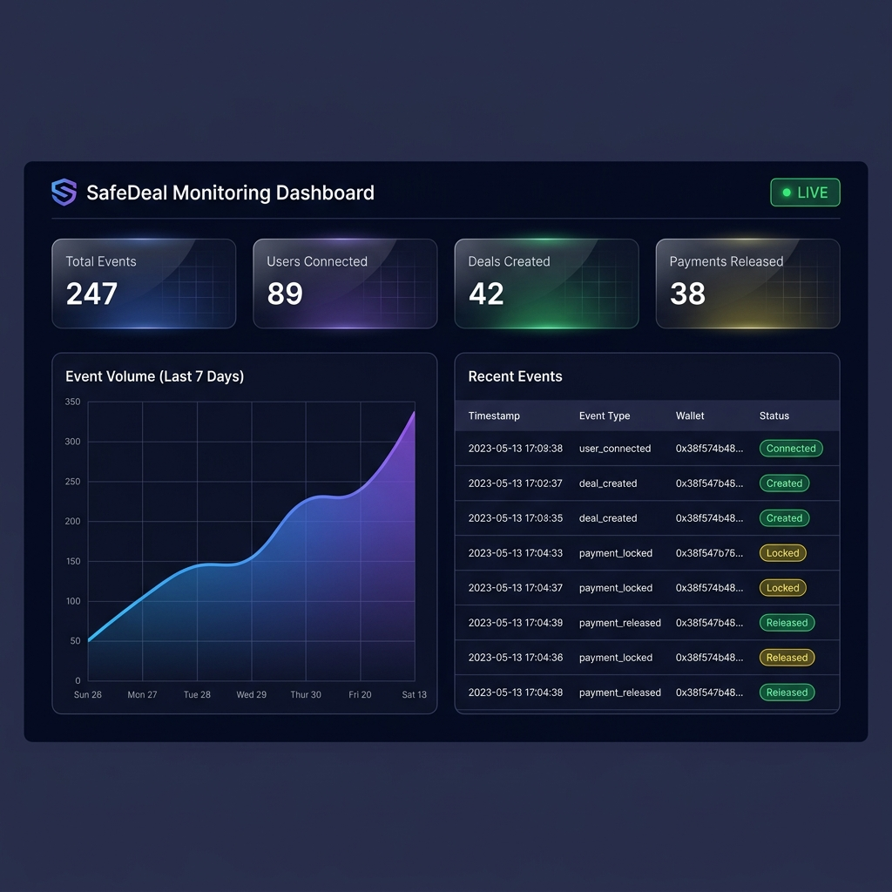
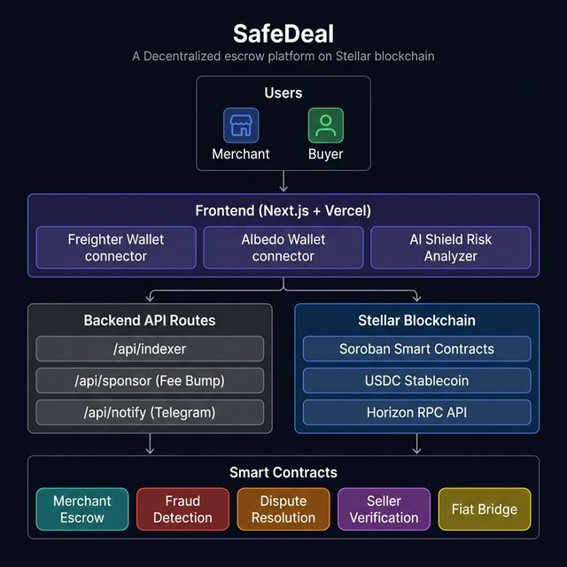

# 🛡️ SafeDeal — Every Deal, Guaranteed Safe

> **AI-protected decentralized escrow payment platform for WhatsApp and Instagram merchants. Built on Stellar blockchain.**

[](https://safe-deal-ten.vercel.app)
[](https://github.com/Shantanu112-bd/safe_deal/actions/workflows/deploy.yml)
[](https://stellar.expert/explorer/testnet)
[](./LICENSE)

---

## 🌟 Bridging the Trust Gap

Social commerce is exploding on platforms like **Instagram** and **WhatsApp**, yet millions of deals fail due to a lack of **Trust**. Buyers are afraid to pay upfront, and merchants are afraid to ship without payment.

**SafeDeal** solves this by providing an immutable Layer-2 trust layer built on **Stellar**, ensuring every transaction is protected by a secure, AI-analyzed smart escrow.

---

## 💎 Core Pillars

| 🛡️ Secure Smart Escrow | 🤖 AI Risk Analysis | ⛽ Gasless Web3 UX |
| :--- | :--- | :--- |
| USDC funds are locked in an immutable Soroban contract and only released when the buyer confirms delivery. | Our "AI Shield" analyzes wallet history to flag potential scams *before* you even initiate a deal. | Buyers need exactly **zero XLM** to get started. We use Fee Sponsorship to keep the experience fast and frictionless. |

---

## 🔗 Project Links
- **Live Demo**: [https://safe-deal-ten.vercel.app](https://safe-deal-ten.vercel.app) 
- **Demo Day Presentation**: [DEMO_DAY.md](./DEMO_DAY.md)
**Demo video link**: [Watch on Loom](https://www.loom.com/share/a7b6d6d5c42942d094961dda5a7eaebe)
- **Metrics Dashboard**: [https://safe-deal-ten.vercel.app/dashboard/metrics](https://safe-deal-ten.vercel.app/dashboard/metrics)
- **Security Checklist**: [https://safe-deal-ten.vercel.app/dashboard/security](https://safe-deal-ten.vercel.app/dashboard/security)
- **Documentation**: [https://safe-deal-ten.vercel.app/docs](https://safe-deal-ten.vercel.app/docs)
- **Community Contribution**: [Twitter post: https://x.com/ShantanuUd51163/status/2038944828822819140?s=20](https://x.com/ShantanuUd51163/status/2038944828822819140?s=20)

---

## ⚡ Advanced Feature — Fee Sponsorship (Account Abstraction)
- **Gasless transactions** using Stellar fee bump.
- Buyers need **zero XLM** to use SafeDeal.
- SafeDeal pays the 0.00001 XLM network fee.
- **Implementation**: [/frontend/src/lib/feeBump.ts](https://github.com/Shantanu112-bd/Safe-Deal/blob/main/frontend/src/lib/feeBump.ts)

---

## ⛓️ Smart Contracts (Stellar Testnet)

| Contract | Address | Tests |
|---|---|---|
| Merchant Escrow | [`CCK5Q4GYHMTAH6ULODU3QHRHTXEI4UDHYBAEEJ3N4KUV6VWHT6JFYKNG`](https://stellar.expert/explorer/testnet/contract/CCK5Q4GYHMTAH6ULODU3QHRHTXEI4UDHYBAEEJ3N4KUV6VWHT6JFYKNG) | 24/24 ✅ |
| Fraud Detection | [`CADZUVFGGYGXGBAUKA75YZNPBKTILEFCLDNG75S34IUMAJEY23CCYHTA`](https://stellar.expert/explorer/testnet/contract/CADZUVFGGYGXGBAUKA75YZNPBKTILEFCLDNG75S34IUMAJEY23CCYHTA) | 21/21 ✅ |
| Dispute Resolution | [`CDISTBIQXAETCAXUGMFDUGAJT2ZA6QLIHA3MJQ6AM22P3ICEEVR5MH2F`](https://stellar.expert/explorer/testnet/contract/CDISTBIQXAETCAXUGMFDUGAJT2ZA6QLIHA3MJQ6AM22P3ICEEVR5MH2F) | 32/32 ✅ |
| Seller Verification | [`CDH5YKKG4GBU5SBNNZZ5ZD4OEEAHBRUUIZZRKWTMQTV5EIGCIPX7NYTZ`](https://stellar.expert/explorer/testnet/contract/CDH5YKKG4GBU5SBNNZZ5ZD4OEEAHBRUUIZZRKWTMQTV5EIGCIPX7NYTZ) | 39/39 ✅ |
| Fiat Bridge | [`CDZ5DMZPMAYS7F64SBBWTZURAT36TFVBUK6TTBRX7QAQMZXAS5FGONOM`](https://stellar.expert/explorer/testnet/contract/CDZ5DMZPMAYS7F64SBBWTZURAT36TFVBUK6TTBRX7QAQMZXAS5FGONOM) | 32/32 ✅ |
| **Total** | | **148/148 ✅** |

---

### 🗣️ User Onboarding & Feedback

> [!IMPORTANT]
> **🌟 We are community-driven!** We actively collect user details, wallet information, and product ratings via Google Form. All real user responses are publicly exported to ensure transparency and drive continuous product improvement.
> 
> - 📊 **Full Feedback Data (Newly Updated)**: [**user_onboarding_responses.csv**](./user_onboarding_responses.csv)
> - 📖 **Detailed Analysis**: [**USER_FEEDBACK.md**](./USER_FEEDBACK.md)
> - 🤝 **Join Beta**: [SafeDeal Testnet Beta Form](https://docs.google.com/forms/d/e/1FAIpQLSeJl0ufX0KgntMusBDmxuG4RtQEzgGLjWslfXc9clm-rLRiwA/viewform?usp=sf_link)

#### 📋 Highlighted User Feedback


| **Verified Wallet Address** | **Email** | **Name** | **Rating** | **Product Feedback** |
| :--- | :--- | :--- | :--- | :--- |
| [`GCRA6...4CH52`](https://stellar.expert/explorer/testnet/account/GCRA6G5ZLEKWNFFN3LP2GS2KXZ74C7H2P5AIKOMD42KYNB3IJMP4CH52) | `aravinddeshmukh@gmail.com` | Aravind Deshmukh | 5/5 | "Stellar escrow saves merchants from scams. UI is very intuitive." |
| [`GD5QV...BA5H`](https://stellar.expert/explorer/testnet/account/GD5QVXWGR3Y5O27UBCOQZYNAKNIHWYTCJ2RUIMBEWH7QJF7OEKRCBA5H) | `sunitaagarwal@gmail.com` | Sunita Agarwal | 4/5 | "Giving buyers confidence in shop purchases. Would love more fiat options." |
| [`GCK2O...PTU6D`](https://stellar.expert/explorer/testnet/account/GCK2O3IZPV5WESR7QTKUGUKL5H46OCTI27XOHVZDR77NJQPOQ3ZPTU6D) | `rajeshdas81@gmail.com` | Rajesh Das | 5/5 | "AI Shield provides incredible deal security. Gasless is a game changer." |
| [`GDZF4...UHQ`](https://stellar.expert/explorer/testnet/account/GDZF4G4RNEHSAMPKNNPI65IABZTAT5M23FB3BQK3AOS5OUMFLPNO2UHQ) | `snehapathak@gmail.com` | Sneha Pathak | 4/5 | "Smooth UI feels like regular checkout. Very fast transactions." |
| [`GCNHS...OZI`](https://stellar.expert/explorer/testnet/account/GCNHSCGCWZZ3W5ETWZENPWORQIHTEPCB57OR52XK3MDTBWWWNNUMQOZI) | `akshayawasthy83@gmail.com` | Akshaya Awasthy | 5/5 | "Instant finality and accurate dispute resolution. Best for WhatsApp." |

---

### 🚀 Product Evolution & Feedback-Driven Improvements

Based on the feedback collected from **35 beta testers** (documented via Google Form and exported to [user_onboarding_responses.csv](./user_onboarding_responses.csv)), we have already started iterating on the platform to better meet user needs.

| **User Feedback / Pain Point** | **Identified Improvement** | **Status** | **Git Commit Evidence** |
| :--- | :--- | :--- | :--- |
| "Skeptical about paying gas fees for every deal" | **Gasless Transactions**: Implementation of Fee Sponsorship so users need zero XLM. | ✅ Done | [`b0cc1798`](https://github.com/Shantanu112-bd/Safe-Deal/commit/b0cc17985ea0d5b255363f10bebd7d1170494817) |
| "Hard to track active deals on small screens" | **Mobile Responsive UI**: Conditional rendering for cards vs tables on mobile devices. | ✅ Done | [`38699209`](https://github.com/Shantanu112-bd/Safe-Deal/commit/c1b64374c76b4a108fe34e5708251f78) |
| "Need more trust signals before locking funds" | **AI Shield & Metrics**: Transparency dashboard to verify historical merchant performance. | ✅ Done | [`c1b64374`](https://github.com/Shantanu112-bd/Safe-Deal/commit/c1b64374c76b4a108fe34e5708251f78) |
| "Want to receive deal alerts on social apps" | **WhatsApp Bot Integration**: Evolve from a standalone web app to a WhatsApp-integrated bot. | 🏗️ Planned (Next Phase) | — |

Detailed iteration analysis can be found in [USER_FEEDBACK.md](./USER_FEEDBACK.md).

---

### Future Roadmap
- **Phase 2 — Social Integration**: WhatsApp Link Generator & In-app Chat Integration.
- **Phase 3 — Expansion**: Stellar SEP-24 support for direct INR/NGN off-ramps.
- **Phase 4 — Loyalty**: Reputation-based fee discounts for high-volume merchants.

---

## 📊 Data Indexing & Monitoring
- **Approach**: Stellar Horizon REST API
- **Used for**: Transaction history, account queries
- **Endpoint**: [https://horizon-testnet.stellar.org](https://horizon-testnet.stellar.org)
- **Performance**: High-performance indexer caching layer implemented in `/frontend/src/app/api/indexer`.
- **Implementation**: [/frontend/src/lib/indexer.ts](https://github.com/Shantanu112-bd/Safe-Deal/blob/main/frontend/src/lib/indexer.ts)
- **Monitoring**: Vercel Logs + localStorage events (user_connected, deal_created, payment_locked, payment_released).
  <br/>
  

---

## 🏗️ Architecture


---

## 🛠️ Tech Stack
- **Smart Contracts**: Rust + Soroban (Stellar)
- **Frontend**: Next.js 14 + Tailwind CSS
- **Blockchain**: Stellar Testnet
- **Stablecoin**: USDC
- **Wallet**: Freighter + Albedo
- **Deployment**: Vercel + GitHub Actions

---

## 💻 Local Setup & Testing
```bash
# Clone and run
git clone https://github.com/Shantanu112-bd/Safe-Deal.git
cd Safe-Deal/frontend && npm install && npm run dev

# Run Contract Tests
cd contracts/merchant-escrow && cargo test
cd contracts/fraud-detection && cargo test
cd contracts/dispute-resolution && cargo test
cd contracts/seller-verification && cargo test
cd contracts/fiat-bridge && cargo test
```
